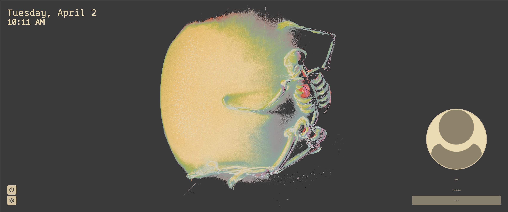

# NDCT

Nix Dynamic Color Theme for [SDDM](https://github.com/sddm/sddm) that is inspired by [corners](https://github.com/aczw/sddm-theme-corners).

Thanks for developers of [lutgen-rs](https://github.com/ozwaldorf/lutgen-rs).

</img>

## Installation

Package is meant to be installed only on NixOS, otherwise just install [original package](https://github.com/aczw/sddm-theme-corners)

### NixOS

Just add this flake as an input and reference its package output for installation. Then use it within your config by name for sddm theme.

```nix
inputs.ndct-sddm.url = "github:id3v1669/ndct-sddm-corners";
inputs.ndct-sddm.inputs.nixpkgs.follows = "nixpkgs";

...

# default package output is the Qt6 build
inputs.ndct-sddm.packages.${pkgs.hostPlatform.system}.ndct-sddm-corners

...

services.displayManager.sddm = {
  enable = true;
  package = pkgs.kdePackages.sddm; # Qt6 SDDM
  theme = "ndct";
};
```

> The Qt6 theme needs no `extraPackages` — it propagates its own Qt deps
> (`qtdeclarative`, `qtsvg`). For a Qt5 SDDM, use the `ndct-sddm-corners-qt5`
> package output instead.

## Configuration

To edit colors, use 'override'
```nix

inputs.ndct-sddm.packages.${pkgs.hostPlatform.system}.ndct-sddm-corners.override {
  base00 = "000000";
  base01 = "0000AA";

  ...

}

```

## License

This project is licensed under GPLv3. Check it out [here](LICENSE).

## Thanks!

That's pretty much it :) I hope you enjoy the theme. Feedback is much appreciated!!
